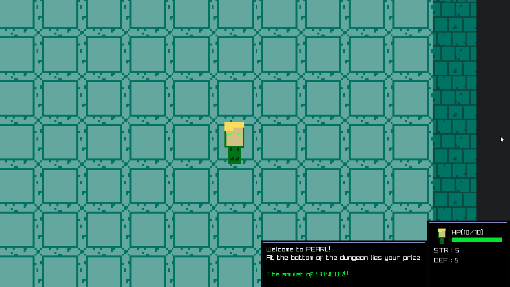
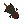
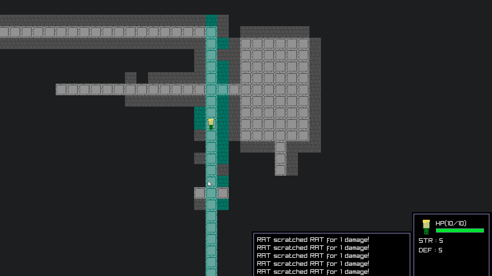
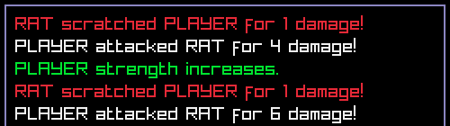

# Proiect: PEA-RL

## Tema proiect: un joc de tip [roguelike](https://en.wikipedia.org/wiki/Roguelike) 

## Tehnologii: 
- GUI utilizand libaria [Raylib](https://www.raylib.com/) mai exact portul pentru Java [jaylib](https://github.com/electronstudio/jaylib)
- Multi-threading, planul ar fi sa avem un thread pentru rendering unul pentru input polling si unul pentru game logic
- JSON - texturepacks

## Welcome to PEARL
Your objective is to obtain the amulet of Yandor by navigating through the dungeon. 

### Controls

You can move your character using the WASD.

Trying to move on top of an enemy will attack it.

Trying to move on top of an interactable will interact with it.

You can zoom in and out using the mouse-wheel.

### Enemy and treasure

You can collect power-ups to boost your stats:

   

At the end of the level you will find a set of stairs leading further through the dungeon. .

Beware the rats . Even though they are weak individually you don't want to get swarmed by them.

### Your vision is impaired
As you move trough the level you discover more of its topology but you will forget whatever entities you saw.

The colored tiles are the ones directly in your sight. The greyed out ones are tiles you saw once and memorized. The rest of the map is covered by the fog of war.

### Keep an eye on the log

In the bottom right corner you can see your log and stat-sheet.
The log displays information about your combats and entity interactions.

